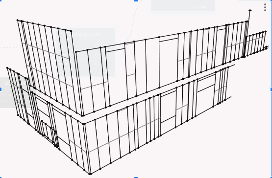

#### Structural analysis workflow development for wood framing design models from hsbCAD

## 27/02/2023
> tasks
1. Test hsbDesign for Revit and AutoCAD
   
> details
1. free trial for hsbCAD was received from Frank so I could open sample models and test the functionality to understand the workflow

> results
1.  got an understanding of hsbCAD workflow, and learned about the features of TSL scripting for hsbCAD API. Started exploring options for structural analysis plugin development

## 03/03/2023
> tasks
1. Test hsbCAD analytical model functionality

> details
1. hsbCAD offers several options for analytical model creation and input. The model can be exported as dxf file, but it doesn't contain any information about the analytical members. The analytical model exported to dxf was of a low quality nad needed a lot of manual adjustments. Also, there is an export to Dlubal RFEM, after thorough testing of this feature it became clear that it also needs a lot of manual adjustments in order to run the analysis of the model. There were several support sessions with Frank, but they didn't help find a better ways with out of the box tools.

> results
1. Analytical model export options of hsbCAD were explored. Unfortunately, they are very basic and export just the centerlines of the elements and doesn't take into account the connections of the elements and any simplifications of the model. Other options need to be explored

## 21/03/2023
> tasks
1. Explore other analytical model export options

> details
1. after figuring out that standard hsbCAD tools for analytical model are very basic and don't fit the purpose I tried to work with IFC model. I exported the IFC model from hsbCAD and imported it into Revit. The model was good and each individual element had the parameters from the hsbCAD wich can be manipulated with Dynamo. It was decided to try working with IFC model in Revit using Dynamo. Initial testing showed that it is quite easy to extract geometry for analytical model from IFC components.

> results
1. The way to get the anlytical model was chosen. It was decided to move forward with hsbCAD to Revit (with Dynamo scripting) to Robot workflow.

## 27/03/2023
> tasks
1. Prepare the structural analysis process description

> details
1. In order to have a correct analysis workflow it was decided to organize a consultation with Dan (experienced engineer) to understand general analysis workflow for wood framing design in Australia. I got several useful insights from him and he shared a couple of ideas regarding the workflow. The session was recorded for future review.

> results
1. After the session with Dan structural analysis workflow description was created with specific scripts and their features.

## 27/04/2023
> tasks
1. Start the workflow realization

> details
1. Because of the lack of time and need to progress with the workflow it was decided to add the Dynamo developer for the project. All the information was passed and explained to the developer.

> results
1. Developer was added to the project team to be able to progress faster with the workflow development

## 01/05/2023
> tasks
1. For the new developer to look through the initial data, models and process description and prepare questions
2. Start working on Size check script

> details
1. there were problems with opening DWG files without hsbCAD plugin on the computer of new developer, that's why the previously exported IFC was used for Dynamo scripting. The process steps were revised after the conversation with the new developer, more manual steps were added to reduce the complexity of the scripts.
2. there is no data for comparison of the model elements, it was requested.

> results
1. Initial data was reviewed by the programmer and all the questions resolved
2. The basic algorithm for geometry check scripts was created, waiting for the elements catalog

## 05/05/2023
> tasks
1. Check the draft analytical model script and continue developing it

> details
1. some of the nodes used in the script were old and had to be replaced with new versions

> results
1. The script was fixed and now it creates the element's centerlines based on the geometry from IFC model

## 06/05/2023

> tasks
1. create the analytical model from the element's centerlines, fix the connections of the analytical elements

> details
1. because the element's centerlines are not aligned, they need to be unified to be in one plane

> results
1. the algorithm for aligning the analytical elements was created, but it don't work for all the cases

## 08/05/2023
> tasks
1. add functionality to join double beams into one analytical model

> details
1. in locations were there are multiple stacked top or bottom plates we need to have one analytical element for them

> results
1. the algorithm for joining horizontal beams was created

## 10/05/2023
> tasks
1. add functionality to join double beams into one analytical model

> details
1. in locations were there are multiple stacked studs we need to have one analytical element for them

> results
1. the algorithm for joining vertical beams was created

## 12/05/2023
> tasks
1. create analytical elements for nogging beams

> details
1. nogging beams provide the shear stiffnes and need to be taken into account in analysis

> results
1. the algorithm for creating analytical model for nogging was created

## 14/05/2023
> tasks
1. create algorithm for assigning structural parameters to the analytical elements

> details
1. I still don't have information about the section sizes and material properties, generic properties were assumed for the algorithm

> results
1. parameters assigning algorithm was created, waiting for the real properties spreadsheet

## 17/05/2023
> tasks
1. test the export to Robot Structural Analysis

> details
1. after assigning the structural properties, the model was sent to the analysis software

> results
1. exported model was tested for self-weight loads and it behaved as expected

## 20/05/2023
> tasks
1. Fix the analytical model creation issues

> details
1. script doesn't work as expected in the corners and for elements like headers and sills

> results
1. Fixed some of the issues with corners, working on remaining issues

## 22/05/2023
> tasks
1. Fix the analytical model creation issues

> details
1. script doesn't work as expected in the corners and for elements like headers and sills

> results
1. corner issues for most of the cases were resolved

## 24/05/2023
> tasks
1. Fix the analytical model creation issues

> details
1. script doesn't work as expected in the corners and for elements like headers, sills and blocking

> results
1. corner issues resolved, started working on nogging beams

## 31/05/2023
> tasks
1. Fix nogging and headers analytical model connection with studs

> details
1. trimming nogging and headers centerlines to fit between the studs

> results
1. nogging and headers are working as expected

 

## 02/06/2023
> tasks
1. Create an algorithm for assigning structural properties to elements that consist of multiple beams

> details
1. in case when the multiple stacked studs are used, they need to have one analytical model with a double stud section

> results
1. the algorithm for assigning custom stacked sections was created

## 05/06/2023
> tasks
1. Correct the behavior of sill studs and blocking
 

> details
1. sill studs and nogging doesn't work properly in the areas near double studs

> results
1. the behavior was corrected

## 06/06/2023
> tasks
1. Create algorithm for floor beams

> details
1. to simplify the model all floor beams assumed to be in one level, so the script should be able to align the beam's analytical models

> results
1. started scripting, but there are issues with grouping the beams, working on it.

## 08/06/2023
> tasks
1. Incorporate the section sizes and material properties based on the provided spreadsheet

> details
1. the information about the available section sizes and material properties was received

> results
1. the script was adjusted to use the available information, several other related issues were resolved

## 09/06/2023
> tasks
1. Fix the connections of the floor beams

> details
1. Since beams in different directions are fed into one list, it is difficult to set up the correct connection. I try to split by directions and look for intersections, but then not all beams get into the result.

> results
1. I still haven't solved this problem, working on it.

 

## 11/06/2023
> tasks
1. Fix the connection of the floor beams
2. Adjust script to be able to work with inclined roofs

> details
2. When I started making the roof, I discovered that the Bounding Box for constructions does not take into account the slope of the beams, I also realized that if the wall is not perpendicular to the main axes, this will also affect. As a result, I am currently on the lookout for getting an unaligned Bounding Box.

> results
1. Solved the problem with the connection for floors.
2. Partially solved, working on it

## 13/06/2023
> tasks
1. Adjust script to be able to work with inclined roofs

> details
1. I managed to create a slanted cuboid. Accordingly, I had to change the method of obtaining the center line. Next, I worked on optimizing these parts of the script to apply it to other frame types.

> results
1. algorithm created, need to be optimized for different cases

## 14/06/2023
> tasks
1. Optimize roof algorithm

> details
1. I was looking for a new way to group points along the Z coordinate. Previously, I found a group of points at a height of 1 m and calculated the average Z coordinate. This does not work for sloped beams.

> results
1. Still looking for a better solution

## 15/06/2023
> tasks
1. Optimize roof algorithm

> details
1. I managed to create an algorithm that looks for connections much better and works for beams at an angle. But now I myself choose which lists to apply for intersections, so then I need to make the script work for any case

> results
1. The solution was found, but need to be automated because for now it needs manual interactions

## 17/06/2023
> tasks
1. Fix the issue with mesh geometry

> details
1. The algorithm for obtaining analytics is already working good. In the process of work, I had a problem - when getting the geometry, some beams become meshes and not solids. I had to supplement the algorithm to obtain a solid based on this geometry.

> results
1. The issue has been resolved

## 19/06/2023
> tasks
1. Fix the unpredicted behavior of the roof beams.

> details
1. Worked with a script to fix such line displacement when connecting

> results
1. Still working on the issue

## 20/06/2023
> tasks
1. Fix the unpredicted behavior of the roof beams.

> details
1. Worked with a script to fix line displacement when connecting

> results
1. Fixed the problem and added new improved algorithms to wall elements

## 22/06/2023
> tasks
1. Fix the analytical model creation issues found during testing

> details
1. The issues with the floor beams and connection to the walls need to be discussed with the team

> results
1. After the discussion it was decided to make the simpler connections of the wall framing with floor beams, need to be consulted further with Dan

## 26/06/2023
> tasks
1. Work on optimizing the wall studs grouping

> details
1. Since the wall elements were grouped along the walls, when the grouping was removed, there was a problem with the correct combination and deviation of the lines from the plane.
 First I needed to adjust the view in Revit to hide the non-load-bearing walls. Next, I tried to connect the plates so that the node coincided with the corners of the walls. At first, I tried to lengthen to the nearest point, but this does not work everywhere. As a result, the solution was to lengthen the start and the end of the lines, find the intersection point, and then use this point as the nearest one. But at the same time, it was necessary to exclude lines that should not intersect.

> results
1. The algorithm was optimized

## 28/06/2023
> tasks
1. Optimize corner connections to have a simplified and clean representation

> details
1. Because of the accumulation of studs in the corners of the walls, the central line of the combined elements was shifted from the real corner. I worked to ensure that this line is transferred to the corner of the intersection of the plates where necessary. There were also problems in the corners where there is a difference in the walls height.

> results
1. The problem was solved by setting up additional grouping and moving corner post points to the nearest plate points.

## 30/06/2023
> tasks
1. Optimize script performance

> details
1. I continued to work on the correct merging scheme.

> results
1. Improved the algorithms for connecting the corners of the walls so that the algorithms take into account more possible options. In parallel, I immediately simplify parts of the algorithm. For example, I translated in the Code Block for removing very short lines from the list, created a definition formula for grouping the coordinates of points and replacing them with an average value, and improved the formula for creating a central line.

## 01/07/2023
> tasks
1. Fix the issue with the connection of the floor beams with wall framing

> details
1. There was a problem with the corner points of the walls of the first floor, the floor and the walls of the second floor are not on the same line. So, when creating a joint node, the lines deviate from the plane. I've been working on aligning all points to the nearest coordinates.

> results
1. I created an algorithm that groups points by the nearest X, Y, Z coordinates, then finds the average value for X and Y and replaces these values at the selected points. Next, the script looks for the distance from the start and end points of the line to the created points. The nearest 2 points are the new points to draw the line.

## 02/07/2023
> tasks
1. Optimizing the script performance

> details
1. This algorithm (The script looks for the distance from the start and end points of the line to the created points. The nearest 2 points are the new points to draw the line) is often repeated, so I worked on creating a define formula from this. Since I used custom nodes in this algorithm, in order to convert in the Code Block, I needed to change some parts of the algorithm, leaving the same working principle.

> results
1. The algorithm was optimized

## 05/07/2023
> tasks
1. Fix the issue with the connection of the floor beams with wall framing

> details
1. Aligning the Z coordinates of the points did not give the desired result, so I create lines according to the aligned X and Y coordinates and then look for the plates closest to the beams, then transferred them to the same plane with the beams.

> results
1. I came to the conclusion that it is necessary to manually filter all non-bearing plates from the view, because they violate the geometry of the beams and this makes it difficult to set the design parameters for the element. Perhaps in the future, this can be done with another script.

## 9/07/2023
> tasks
1. Attaching the studs to the floor frame.

> details
1. Adjustment of studs extensions to new analytical lines at floor level. Alignment of the walls along the axes and adjustment of the corner joints according to the scheme found earlier.

>results
1. The algorithm for creating a wall frame works correctly. The central analytical line for a group of studs is located exactly at the corners of the intersections. So far, there is a problem with the transfer of wall studs to floor beams in places where the perpendicular beam passes, because there is the nearest intersection point.

## 11/07/2023
> tasks
1. Correction of non-vertical studs.

> details
1. Search for all non-vertical studs. Creation of an algorithm that searches for one of the studs points that match the model node, then, based on this point and the Z coordinate of the second point, creates a new correct point.

>results
1. Based on the obtained points, create the correct vertical studs.

## 12/07/2023
> tasks
1. Adjust tolerances.

> details
1. During the development of the script, it turned out that for each type of structure, a different tolerance is required for the correct operation of the union (for example, for floor beams it is 150 mm, and for studs - 300 mm). It was necessary to study the work of the script in different conditions of tolerances.

>results
1. In the formula for creating a transferred line, I added a tolerance as a separate input. In my opinion, these parameters will need to be put into an input for the user

## 14/07/2023
> tasks
1. Setting up blocking creation.

> details
1. There were problems with the incorrect creation of analytical blocking lines after simplifying the general analytical model. And there was also a problem with creating lines for blockings that are converted to a mesh and not a solid.

>results
1. An algorithm for the center line from the mesh has been added. Work continues on the correct creation of blocks.

## 14/07/2023
> tasks
1. Setting up blocking creation.

> details
1. Removed short blocking lines from the list. I worked on getting the blocking lines to join the studs. Because the studs were connected at a small distance, the blockings may not reach one of the studs. It was necessary to add an extension of the lines from both ends and then attach them.

>results
1. Basically, analytical blocking lines are built correctly. There was one problem with joining blockings to sill studs.

## 18/07/2023
> tasks
1. Attaching the roof.

> details
1. Worked on ways to attach the roof to the frame. Since the roof should not be connected to the walls at all points, this causes difficulties for the algorithm. Several methods for joining have been tried.

>results
1. There is no correct result yet.

## 20/07/2023
> tasks
1. Roof fixing.
2. Set up the selection of the correct family to assign the cross section of the element.

> details
1. For the correct union of elements, all types had to be divided into separate algorithms and the connection was assigned separately.
2. Work on the creation of an algorithm for finding the family closest to the cuboid.

>results
1. Roof elements are created and attached to the main frame.
2. The algorithm gets the desired family, but still needs to be improved.

## 22/07/2023
> tasks
1. Set up the selection of the correct family to assign the section of the element.

> details
1. Worked on an algorithm that gets all the dimensions of the cross sections in the project, then creates lists of ranges. Then the dimensions of the cuboid are compared with the ranges and the algorithm gets the nearest number for the size.

>results
1. An algorithm has been developed for selecting a section of an element.

## 23/07/2023
> tasks
1. Create a list of families.

> details
1. Creation of family types based on the table and additional types for connected elements. Checking the health of families in Autodesk Robot.

>results
1. Created a list of family types for PINE and LVL.

## 24/07/2023
> tasks
1. Creation of materials with design characteristics.

> details
1. Creation of materials in Revit with filling in all the calculated parameters of the material. Further, obtaining these materials in the dynamo and assigning this material to the analytical lines in the model, depending on the type of element.
 
>results
1. Materials "radiata,seasoned" and "WESBEAM" are created and assigned to analytic elements.

## 25/07/2023
> tasks
1. Analysis of the script's performance for the entire scheme.

> details
1. Repeated runs of the script were carried out for the entire model and its parts. It was found that there are elements in the model that cause looping of the code. Therefore, only a fully working half of the circuit was used for verification, on the basis of which an analytical model was built. After the model was exported to Autodesk Robot.
 
>results
1. The script works for most of the scheme and correctly assigns the sections of the elements and the characteristics of the materials. Code looping has been detected.

## 27/07/2023
> tasks
1. Search for looping in the code.

> details
1. Finding the part of the circuit where looping occurs by gradually moving the boundary of the Section Box. I ran the script every time after expanding the border until I found the area where the script was hanging.
 
>results
1. A part of the model on which the script is freezing was found. The script processes all other parts of the model in about 8 minutes.

## 29/07/2023
> tasks
1. Work with a section of the circuit where the code loops.

> details
1. After I found the site, I used the Section Box displacement method to look for an element or several elements that cause the script to freeze. I found a section of the wall where the wall elements overlap. Next, I hid them in the working view and this area was processed with a script. But when we tried again to run the script for the entire circuit, it turned out that this is not one place in the model where looping occurs.
 
>results
1. Problem elements were found. It was also found that there are several places in the model where the script can hang.

## 31/07/2023
> tasks
1. Finding ways to find problem areas in the model.

> details
1. Since overlaps of elements or other possible problems can occur in the model, and the search for these areas manually takes a lot of time, I was looking for a way to automate this process. I've tried Python Scripts to limit the script's run time so that if it hangs, there's no need to crash the program.
 
>results
1. Nodes and Python Script have been tried to limit the work of the script, but so far this does not give the necessary results.
